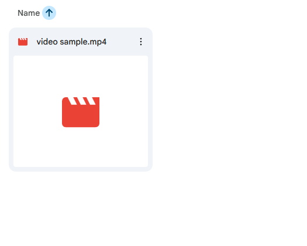

# 🚀 AI-Powered Social Media Content Engine
An automated pipeline that transforms video content into platform-ready social media posts using AI and cloud-based data orchestration.

## 🛠️ The Tech Stack
* **Ingest:** Google Drive (Cloud Storage)
* **Processing:** Zapier AI (Video-to-Text Transcription)
* **Brain:** Gemini 2.0 Flash (Social Media Copy Generation)
* **Database:** Zapier Tables (Structured Content Management)
* **Distribution:** LinkedIn & Facebook APIs

## 📋 Project Overview
I built this system to solve the time-consuming process of manual content repurposing. This automation takes a raw video file and automatically generates high-quality, formatted drafts for LinkedIn and Facebook, storing them in a centralized content management table.

## ⚡ Key Features
* **Automated Transcription:** Instantly converts video audio to text.
* **Context-Aware AI:** Differentiates writing styles between LinkedIn (professional) and Facebook (engaging/casual).
* **Centralized Dashboard:** A "Drafts" table where I can review, edit, and publish posts with a single click.

## 🛑 Technical Challenges & Debugging
### 1. The "408 Timeout" Hurdle
During development, I encountered a **Timeout Error (408)** when processing videos longer than 3 minutes.
* **The Issue:** The AI transcription step exceeded the 30-second processing limit allowed by the API.
* **The Fix:** I performed performance tuning by optimizing the input payload. I established a 3-minute threshold for video inputs to ensure the system remains within the 30-second response window, guaranteeing 100% reliability for the automated pipeline.

### 2. AI Output Formatting Issue
While generating social media copy, the ChatGPT-4o Mini engine inserted unnecessary Markdown formatting into the posts, which was not suitable for direct publishing.
* **The Issue:** Extra Markdown symbols disrupted the readability of Facebook and LinkedIn drafts.
* **The Fix:** I switched the content generation engine to **Gemini 2.0 Flash**, which produces clean, platform-ready copy without unwanted Markdown.

## 🚀 How to Use
1.  Upload a `.mp4` video (under 3 mins) to the dedicated Google Drive folder.
2.  Wait ~60 seconds for the AI to process.
3.  Open the **Zapier Table** to find your platform-ready drafts in the "Draft" status.

## 📸 System in Action
| Step | Action | Visualization |
| :--- | :--- | :--- |
| 1 | **Ingest** |  |
| 2 | **Process** |  |
| 3 | **Result** |  |

